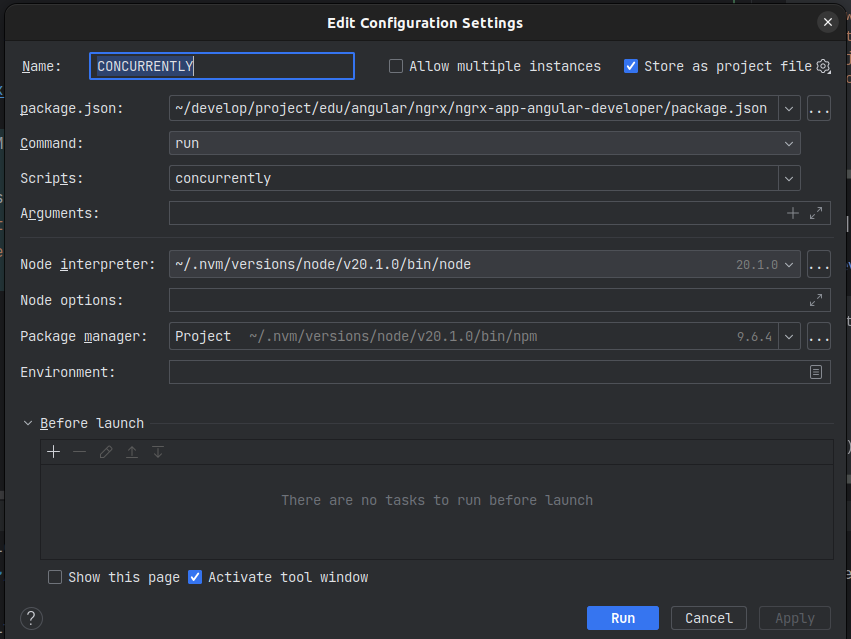

# NGRX from AngularDeveloper.io

## Install Packages
```shell
npm install @ngrx/store
npm install bootstrap@5.3.0-alpha3
npm install @ngrx/store-devtools
```

## Run the Application
Add the libraries `json-server` and `concurrently` via `npm`
```shell
npm install json-server
npm install concurrently
```
Add the script named: `concurrently` to `package.json` of your project. It runs both the `json-server` and the `application`. 
Without `concurrently` one has to start the application and the json-server separately.
```yaml
{
  "name": "ngrx-app-angular-developer",
  "version": "0.0.0",
  "scripts": {
    "ng": "ng",
    "start": "ng serve",
    "build": "ng build",
    "watch": "ng build --watch --configuration development",
    "test": "ng test",
    "json-server": "json-server --watch db.json",
    "concurrently": "concurrently \"ng serve\" \"json-server --watch db.json\" "
  },
...
}
```



### Install Redux Devtools
Link: [DevTools Explained](https://youtu.be/SkoI_VHtcTU?t=281)
```typescript
    StoreDevtoolsModule.instrument({
      maxAge: 25, // Retains last 25 states
      logOnly: !isDevMode(), // Restrict extension to log-only mode
      autoPause: true, // Pauses recording actions and state changes when the extension window is not open
      trace: false, //  If set to true, will include stack trace for every dispatched action, so you can see it in trace tab jumping directly to that part of code
      traceLimit: 75, // maximum stack trace frames to be stored (in case trace option was provided as true)
    }),
```

## Routing Step-by-step
 - The Git branch `routing` depicts an early state of the application which concentrates on the integration of the routing. CLI: `git checkout routing`.
 - Routing video explanation: [Angular NgRx Course - 03 Application Setup](https://youtu.be/QlzX_gKixa4?list=PLaMbwDs23r4KXoMucJEyUAvamQ-kFNBvC&t=223)

1. Create a module AppRouting via `ng g m appRouting --flat` (creates the file: `app-routing.module.ts`)
2. Import and add AppRouting to `app.module.ts` `import {AppRoutingModule} from "./app-routing.module";`
    ```typescript
        import {AppRoutingModule} from "./app-routing.module";
        ...
        @NgModule({
            declarations: [
                AppComponent,                
                NavbarComponent,
                HomeComponent
             ],
            imports: [
                BrowserModule,
                AppRoutingModule,
    ```
3. Define `appRoutes` in `app-routing.module.ts` and lazy load of customer module
   ```typescript
        import {RouterModule, Routes} from "@angular/router";
        ...
        const appRoutes: Routes = [
           { path: "", component: HomeComponent },
           { path: "customers", loadChildren: () => import("../app/customers/customers.module").then(m => m.CustomersModule) }
        ];
  
        @NgModule({
          declarations: [],
          imports: [
            CommonModule,
            RouterModule.forRoot(appRoutes)
          ],
          exports: [RouterModule]
        })
        export class AppRoutingModule {}
   ```
4. Create module `customers` via `ng generate module customers/customers`
5. Define `customerRoutes` in `customers.module.ts`
   ```typescript
        import {RouterModule, Routes} from "@angular/router";
        ...
        const customerRoutes: Routes = [
          {
            path: "",
            component: CustomerComponent}
        ]
  
        @NgModule({
          declarations: [
            CustomerComponent,
            CustomerAddComponent,
            CustomerEditComponent,
            CustomerListComponent
          ],
          imports: [
            CommonModule,
            RouterModule.forChild(customerRoutes),
            ReactiveFormsModule
          ]
        })
        export class CustomersModule { }
   ```
6. Add the `router-outlet` in `app-component.html`
   ```html
   <app-navbar></app-navbar>
   <router-outlet></router-outlet>
   ```

## Add Customer Components
To add components to the previously created module `Customers[customers.module.ts]` do the following:
```shell
ng g c customers/customer -m customers
ng g c customers/customer-add -m customers
ng g c customers/customer-edit -m customers
ng g c customers/customer-list -m customers
```
